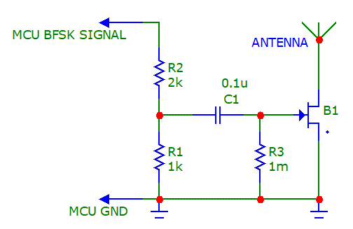
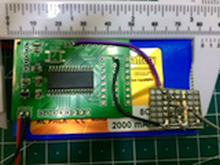
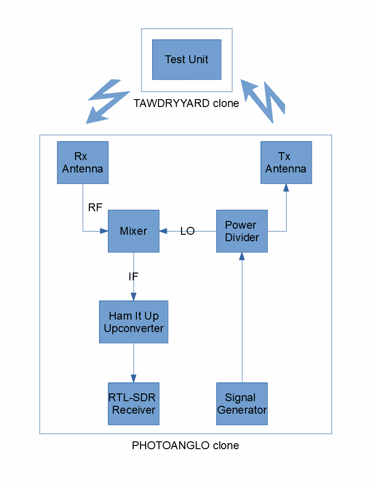
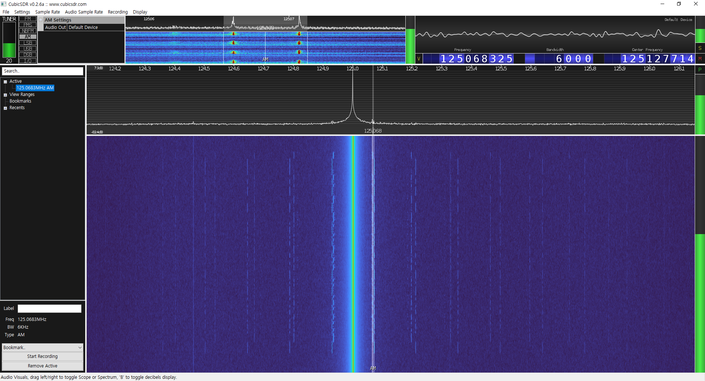

# REPPLREPPL

## Table of Contents
* [Overview](#overview)
* [Description of Operation](#description-of-operation)
* [Schematics](#schematics)
* [Picture](#picture)
    * [Prototype](#prototype)
* [Test Setup](#test-setup)
* [Test Procedure](#test-procedure)
* [Test Result](#test-result)
* [References](#references)

# Overview
REPPLREPPL is a RF retro-reflector.

When illuminated with the CW (Continuous Wave) signal, it re-radiates the BFSK-AM (Binary Frequency Shift Keying Amplitude Modulated) CW signal.

# Description of Operation
The microcontroller generates the BFSK modulated signal. 

The received CW signal from the antenna and the BFSK modulated signal goes to the FET (Field-Effect Transistor).

The FET mixes the BFSK modulated signal and the CW signal to create the BFSK-AM CW signal.

The BFSK-AM CW signal is re-radiated by the antenna.

# Schematics


```
R1, R2: Voltage divider
C1: DC blocking capacitor 0.1uF
R3: Pull-down resistor 1Mohm
B1: RF GaAs FET
```

# Picture
## Prototype


# Test Setup


# Test Procedure
1. Connect the battery to the test unit.
2. Install the test unit to the target.
3. Illuminate the target.
4. Capture the re-radiated signal.

# Test Result

[AM demodulated sound](./Sound.wav)

# References
[TAWDRYYARD ANT Product Data](https://upload.wikimedia.org/wikipedia/commons/8/8f/NSA_TAWDRYYARD.jpg) [(Web Archive)](https://web.archive.org/web/20190422182852/https://upload.wikimedia.org/wikipedia/commons/8/8f/NSA_TAWDRYYARD.jpg)

[PHOTOANGLO ANT Product Data](https://upload.wikimedia.org/wikipedia/commons/9/96/NSA_PHOTOANGLO.jpg) [(Web Archive)](https://web.archive.org/web/20200322183429/https://upload.wikimedia.org/wikipedia/commons/9/96/NSA_PHOTOANGLO.jpg)

[GBPPR TAWDRYYARD Experiments](http://67.225.133.110/~gbpprorg/mil/photoanglo/tawdryyard/index.html) [(Web Archive)](https://web.archive.org/web/20190808144746/http://67.225.133.110/~gbpprorg/mil/photoanglo/tawdryyard/index.html)

[GBPPR PHOTOANGLO Experiments](http://67.225.133.110/~gbpprorg/mil/photoanglo/index.html) [(Web Archive)](https://web.archive.org/web/20190808144648/http://67.225.133.110/~gbpprorg/mil/photoanglo/index.html)
